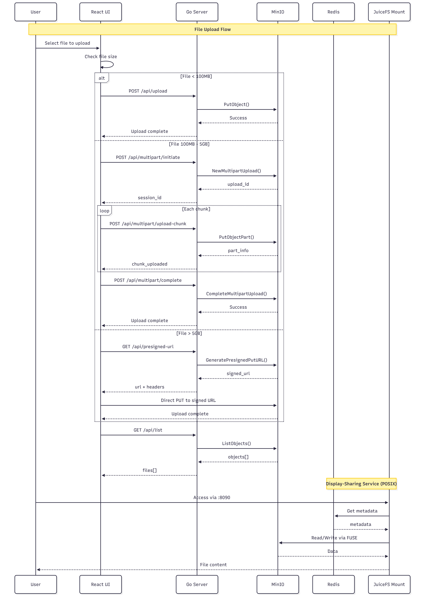

# RClone File Browser

A modern web-based file browser application that provides a user-friendly interface for managing files in MinIO S3-compatible object storage. Built with Go backend and React/Next.js frontend, this solution is designed to work seamlessly in both Docker and Kubernetes environments.

## Features

- **Tree View Navigation**: Browse files and folders in a hierarchical tree structure
- **Flat View Option**: Switch between tree and flat view modes
- **File Upload**: Upload individual files or entire folders while preserving directory structure
- **Drag & Drop**: Intuitive drag-and-drop interface for file uploads
- **Progress Tracking**: Real-time upload progress with visual feedback
- **File Operations**: Download and delete files directly from the UI
- **Folder Structure Preservation**: Maintains original folder hierarchy during uploads
- **Duplicate File Handling**: Choose to rename with UUID or replace existing files
- **Last Modified Display**: Shows modification date/time for all files and folders
- **S3-Compatible**: Uses MinIO for reliable, scalable object storage
- **Kubernetes Ready**: Designed for containerized deployments

## Architecture

```

   React UI  -->  Go Server  -->    MinIO    
  (Next.js)        (API)          (Storage)  
    :3000           :8080              :9000
```



## Quick Start

### Using Docker Compose

```bash
# Clone the repository
git clone https://github.com/khoa-nguyendang/rclone-file-upload.git
cd rclone-file-upload

# Start all services
docker-compose up --build
# Or use the Makefile
make up

# Access the application
UI: http://localhost:3000
API: http://localhost:8080
MinIO Console: http://localhost:9001

# Stop services
docker-compose down
# Or use the Makefile
make down
```

### Default Credentials

- MinIO Root User: `minioadmin`
- MinIO Root Password: `minioadmin123`
- MinIO Access Key: `rclone`
- MinIO Secret Key: `rclone123`

## Why MinIO Instead of RClone FUSE?

While RClone is excellent for distributed file systems, we chose direct MinIO integration for several reasons:

1. **Kubernetes Compatibility**: MinIO uses REST APIs instead of FUSE mounts, making it fully compatible with Kubernetes pod orchestration
2. **Simplicity**: Direct S3 API calls eliminate the complexity of filesystem mounts
3. **Scalability**: Both the Go server and UI can scale horizontally without shared filesystem dependencies
4. **Performance**: Direct object storage operations without filesystem abstraction layer

## API Endpoints

| Method | Endpoint | Description |
|--------|----------|-------------|
| GET | `/api/health` | Health check |
| GET | `/api/list?path=/` | List files in directory |
| POST | `/api/upload` | Upload file with optional path and conflictAction (rename/replace) |
| GET | `/api/download/{filename}` | Download file |
| DELETE | `/api/delete/{filename}` | Delete file |


### Building Images

```bash
# Build server image
docker build -t naturemyloves/file-browser-rclone-server:latest ./server

# Build UI image
docker build -t naturemyloves/file-browser-rclone-ui:latest ./ui

# Build Display sharing image
docker build -t naturemyloves/displaying-sharing:latest ./display-sharing


# Push to registry
docker push naturemyloves/file-browser-rclone-server:latest
docker push naturemyloves/file-browser-rclone-ui:latest
docker push naturemyloves/displaying-sharing:latest
```

## Environment Variables

### Go Server
- `SERVER_PORT`: Server port (default: 8080)
- `MINIO_ENDPOINT`: MinIO endpoint
- `MINIO_ACCESS_KEY`: MinIO access key
- `MINIO_SECRET_KEY`: MinIO secret key
- `MINIO_USE_SSL`: Use SSL for MinIO (default: false)

### UI Application
- `NEXT_PUBLIC_API_URL`: Backend API URL
- `NEXT_PUBLIC_API_TIMEOUT`: API request timeout
- `NEXT_PUBLIC_MAX_UPLOAD_SIZE`: Maximum upload size in bytes
- `NEXT_PUBLIC_DEFAULT_VIEW`: Default view mode (tree/flat)
- `NEXT_PUBLIC_ENABLE_DELETE`: Enable delete functionality
- `NEXT_PUBLIC_ENABLE_UPLOAD`: Enable upload functionality

## License

MIT License - see LICENSE file for details